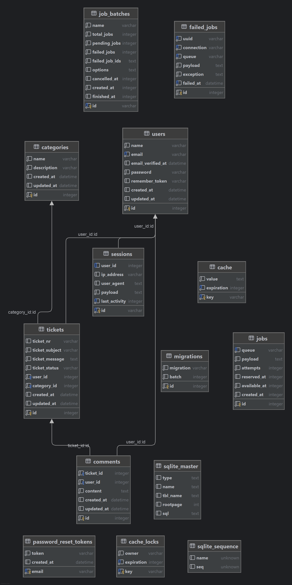

# Support-Ticket-System

## Start Paralleles Arbeiten
Siehe [Anleitung für Cloning](anleitung_clone_pius.md)

Siehe [Aufgabenverteilung im Abschnitt "Installation & Setup"](#aufgabenverteilung)

## Projektbeschreibung
Das Support-Ticket-System ist eine Webanwendung zur Verwaltung von IT-Problemen innerhalb eines Unternehmens. Mitarbeiter können Tickets erstellen, bearbeiten und kommentieren. Support-Mitarbeiter können diese Tickets bearbeiten und den Status verwalten.

## Szenario
Mitarbeiter melden IT-Probleme (z. B. Softwarefehler, Hardwareprobleme oder Netzwerkstörungen). Diese werden als Tickets im System erfasst und anschließend vom Support bearbeitet. Nicht First-Level-Support (Customer Support).

## Datenbankstruktur
**Tabellen**:
- `users` – Benutzerverwaltung
- `tickets` – Support-Tickets
- `categories` – Kategorien für Tickets
- `comments` – Kommentare zu Tickets

**Beziehungen**:

- Ein User kann viele Tickets erstellen (1:n)
- Ein Ticket gehört zu genau einem User (n:1)
- Ein Ticket gehört zu einer Kategorie (n:1)
- Ein Ticket kann viele Kommentare haben (n:1)
- Ein Kommentar gehört zu einem User und einem Ticket (n:1)

## Funktionen
**Ticketsystem**:
- Ticket erstellen
- Ticket anzeigen
- Ticket bearbeiten
- Ticketstatus ändern (z. B. offen, in Bearbeitung, geschlossen)
- Tickets löschen (je nach Rolle)

**Kommentare**:
- Kommentare zu Tickets hinzufügen
- Kommentarverlauf anzeigen

**Kategorien**:
- Tickets einer Kategorie zuordnen

## Benutzer & Rechte
- Benutzer
   - Tickets erstellen und anzeigen
   - Eigene Tickets kommentieren
- Support-Mitarbeiter
   - Alle Tickets bearbeiten
   - Status ändern
   - Kommentare verwalten
- Admin
   - Vollzugriff auf alle Daten
   - Benutzerverwaltung

## Notifications
E-Mail-Benachrichtigung bei:
- neuem Kommentar auf ein Ticket
- Statusänderung eines Tickets

Empfänger: 
- Ticket-Ersteller
- Beteiligte Support-Mitarbeiter
- 
## Sicherheitskonzept & Autorisierung (Paul)
Um die Integrität der Daten und die Privatsphäre der Benutzer zu schützen, wurden folgende Sicherheitsmechanismen implementiert:

1. **Vollständiges User-Management & Authentifizierung:**
   Einsatz von *Laravel Breeze* für kryptografisch sichere Passwörter (Bcrypt) sowie Schutz vor Brute-Force-Angriffen beim Login/Register.

2. **Absicherung kritischer Routen (Middleware):**
   Alle Ticket- und Kommentar-Routen sind durch die `auth`- und `verified`-Middlewares geschützt. Nicht angemeldete Gäste werden automatisch abgefangen und zur Login-Maske umgeleitet (abgesichert via `TicketTest::test_guests_are_redirected_to_login`).

3. **Rechteprüfung mittels Laravel Policies (Data Leakage Protection):**
   Durch die Implementierung der `TicketPolicy` (`view`-Methode) wird auf Controllerebene per `Gate::authorize()` strikt geprüft, ob das angeforderte Ticket dem aktuell angemeldeten Benutzer gehört. Fremde Zugriffe über manipulierte URLs (ID-Guessing) werden sofort mit einem `HTTP 403 Forbidden` blockiert (abgesichert via `TicketTest::test_user_cannot_view_someone_elses_ticket`).

4. **Mass-Assignment-Protection & Validierung:**
   Sämtliche Benutzereingaben werden über *Form Requests* typisiert validiert, bevor sie die Datenbank erreichen. Die Models nutzen das `$fillable`-Array, um das unbefugte Überschreiben kritischer Tabellenspalten (wie `user_id` oder IDs) durch manipuliertes HTML/JSON zu verhindern.

## ER-Diagramm (Entity-Relationship-Diagramm) (Paul)

## Laravel Architektur

- Models (Eloquent ORM) zur Abbildung der Datenbanktabellen und Beziehungen
- Controllers für die gesamte Backend-Logik und CRUD-Funktionen
- Routes in `web.php` zur Verknüpfung von URLs mit Controller-Funktionen
- Views mit Blade Templates für die Benutzeroberfläche (später Umstellung auf React)
- Validation zur Prüfung von Eingaben
- Middleware für Authentifizierung und Zugriffskontrolle

## Tests
- Feature Tests:
   - Ticket erstellen
   - Kommentar hinzufügen
   - Login/Logout
- Validierungstests für Formulare

## Installation & Setup
- Repository klonen
- Dependencies installieren: `composer install`
- `.env` Datei erstellen und konfigurieren
- Datenbank anlegen und Zugangsdaten in `.env` eintragen
- Migrationen ausführen: `php artisan migrate --seed`
- Lokalen Server starten:`php artisan serve`

## Aufgabenverteilung:
- **Pius**: Entwicklung der Benutzeroberfläche mit React, Entwurf des Datenbankmodells, Erstellung von Migrationen und Tests, Fehleranalyse sowie Verwaltung der GitHub-Issues.
- **Paul**: Initialisierung des Laravel-Projekts, Entwicklung der Backend-Logik inklusive CRUD-Funktionalitäten und Controller/Routes, Implementierung der Benutzerverwaltung sowie Erstellung und Dokumentation des Sicherheitskonzepts, ER Diagramm und Datenbankmodell erstellen, Inertia js einrichten mit Laravel Breeze und vorbereiten
- **Gemeinsam**: Ideenfindung, Projektplanung und Qualitätssicherung

## Laufende Dokumentation
Siehe [Befehle-Dokumentation](commands_doc.md)